# Building a Physically Motivated Atmosphere Renderer in Godot 4.5 — An Introduction

There is a particular kind of rendering project where the final image is deceptively simple.

A blue sky. A brighter horizon. An orange sunset. A few stars. Some clouds. Distant mountains becoming hazy.

The image looks simple because all of the complexity has been pushed underneath it.

This series documents the construction of a modular atmospheric rendering system for **Godot 4.5** — not as a single shader, and not as a collection of visual tricks, but as a small rendering stack built around physically motivated scattering, precomputed lookup tables, GPU compute infrastructure, runtime interfaces, and engine integration.

The goal is not to reproduce every detail of a production planetary renderer. The goal is to build something that has enough physical structure to behave plausibly, enough modularity to be useful inside a game engine, and enough engineering discipline that the system can survive contact with a real project.

That distinction matters.

A physically motivated renderer is not just a collection of equations. It is also a resource lifecycle, a data flow, a set of coordinate conventions, a shader interface, a scheduling problem, an editor integration problem, and eventually a performance problem.

This introduction is the map for the series.

The individual posts will go much deeper into the implementation. This post is here so that, months from now, someone can return to the project and understand **what exists, why it exists, how the parts fit together, and where to look when something breaks**.

---

## What We Are Actually Building

At the highest level, the system takes a small set of physical and artistic parameters and turns them into several layers of atmospheric lighting.

The core optical model is based on three major atmospheric processes:

- **Rayleigh scattering** for molecular scattering and the wavelength-dependent blue appearance of the sky.
- **Mie scattering** for aerosols, haze, and the strongly forward-scattered component that becomes important around the sun and at low elevations.
- **Ozone absorption** for wavelength-selective extinction, particularly around the upper-atmosphere ozone layer.

Density is altitude-dependent. Optical depth is accumulated along rays. Transmittance follows Beer's law:

$$
T = e^{-\tau}
$$

where $\tau$ is the integrated optical depth along the path.

The rendering side then builds on that foundation with:

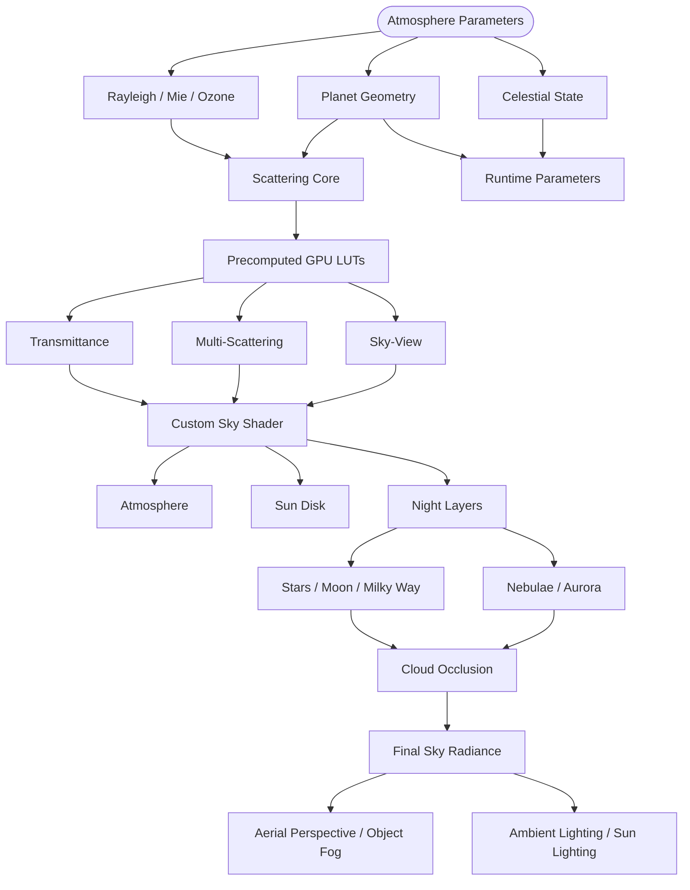

That diagram intentionally includes pieces that are not all evaluated in the same shader.

Some information is precomputed.

Some is evaluated per pixel.

Some is evaluated once per frame.

Some is pushed into Godot's renderer as lighting state.

The architecture is largely about keeping those responsibilities separate.

---

## The Fundamental Rendering Problem

A useful way to think about atmospheric rendering is to stop thinking about "sky colour" and start thinking about **light transport through a participating medium**.

For a point along a camera ray, sunlight can be scattered toward the camera. The amount that arrives depends on:

1. The density of atmosphere along the sun-to-sample path.
2. The scattering coefficient of the participating medium.
3. The phase function describing the angular distribution of scattered light.
4. The density along the sample-to-camera path.
5. Any additional absorption, such as ozone.
6. Contributions from subsequent scattering events.

A conceptual single-scattering term can therefore be thought of as:

$$
L_{1}(v)
\approx
\int
T_{\text{view}}
\;
\beta
\;
P(\theta)
\;
T_{\text{sun}}
\;
L_{\odot}
\;
ds
$$

The problem is not expressing this mathematically.

The problem is evaluating it cheaply enough to use in a real-time renderer.

A naive implementation would repeatedly ray-march the atmosphere for every pixel, and then perform additional integration for the sun path. That becomes expensive very quickly.

The central strategy of this project is therefore:

> **Do expensive, reusable integration ahead of time whenever the quantity can be parameterized into a lookup table; reserve per-pixel work for the information that actually depends on the current camera and scene.**

This is why the project is built around LUTs.

---

## Precomputation Is the Backbone

Three lookup tables form the core of the scattering pipeline.

### Transmittance LUT

The transmittance LUT answers a deceptively important question:

> How much light survives from a point in the atmosphere along a particular direction?

The implementation stores this as a 2D function of observer radius and view zenith angle. The current implementation uses a 256 × 64 texture in the high-quality configuration.

Its job is to make repeated optical-depth queries cheap.

Instead of performing another 64-step atmospheric integration at runtime, a shader can perform a texture lookup.

The underlying implementation uses spherical ray/sphere intersection, altitude-dependent Rayleigh/Mie/ozone density, numerical integration, and Beer's law. A CPU reference implementation mirrors the GPU algorithm so that the numerical result can be tested before the compute shader is trusted.

### Multiple-Scattering LUT

Single scattering is not enough to produce convincing atmospheric brightness.

It becomes noticeably weak:

- around the anti-solar region,
- around long horizon paths,
- and during twilight.

The multiple-scattering pass therefore approximates the light that survives additional scattering events and feeds that contribution back into the sky model.

This is intentionally an approximation rather than a literal infinite scattering simulation. The goal is to recover the broad radiometric behaviour that single scattering misses without turning the sky shader into an unbounded integration problem.

The implementation also demonstrates one of the recurring themes of this project: GPU mathematics and GPU resource layout are equally important. The shader-side `std140` structure must be matched byte-for-byte by the CPU-side buffer packing, including alignment and final struct size. The implementation survived several failures caused by buffers being short by exactly the amount implied by implicit `vec3` alignment.

### Sky-View LUT

The sky-view LUT moves the expensive sky-ray integration out of the final per-pixel path.

Conceptually, it caches atmospheric radiance as a function of view direction and atmospheric state. At runtime the sky shader primarily performs a lookup rather than re-running the full integration for every screen pixel.

That becomes especially important once the atmosphere is no longer the only thing the sky shader needs to draw. The same shader eventually composites celestial and procedural layers, cloud visibility, sun and moon disks, and other effects.

The sky-view LUT therefore changes the architecture from:

```text
Every pixel:
    ray march atmosphere
    → integrate scattering
    → produce sky
```

to:

```text
GPU precomputation:
    integrate atmosphere
    → store directional radiance

Every pixel:
    sample sky-view LUT
    → composite other layers
```

This separation is one of the most important architectural decisions in the entire renderer.

---

## The GPU Foundation: RenderingDevice and Compute

The LUTs only become useful if there is reliable infrastructure to generate them.

For this project, that means working below the normal material abstraction and using Godot 4.5's `RenderingDevice` API for compute work.

The compute path is intentionally reusable:

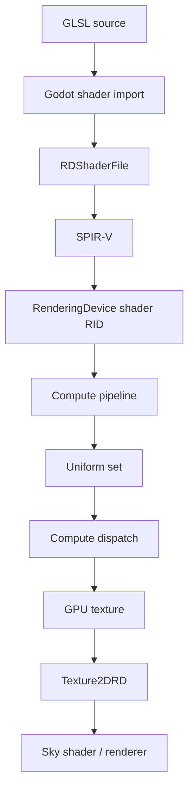

The infrastructure separates:

- `RenderingDevice` acquisition,
- shader/pipeline creation,
- GPU texture allocation,
- buffer management,
- uniform-set lifetime,
- dispatch sizing,
- cleanup and ownership.

That abstraction exists because every LUT follows roughly the same mechanical sequence: create or reuse a GPU texture, bind the parameters, dispatch the compute shader, and expose the resulting texture to the renderer.

There is an important distinction between the **main RenderingDevice** and a **local RenderingDevice**. The main device is the one that shares the renderer's GPU context and therefore produces resources that can be consumed by `Texture2DRD`. Local devices are useful for deterministic testing because they support explicit submission, synchronization, and readback. They are separate Vulkan contexts, so their resources cannot simply be handed to the main renderer.

This dual-device model becomes part of the testing strategy rather than an implementation detail.

The renderer path proves that resources can be consumed by Godot.

The local-device path proves that the compute result is numerically correct.

---

## CPU Reference First, GPU Second

One of the strongest patterns that emerged across the implementation is:

> **Build a CPU reference implementation before trusting the GPU implementation.**

This is especially useful for atmospheric mathematics because GPU failures are often ambiguous.

If a LUT is black, the problem could be:

- the equation,
- the ray/sphere intersection,
- a density function,
- a bad coefficient,
- a wrong uniform,
- a misaligned buffer,
- a bad texture format,
- a broken uniform set,
- a dispatch size,
- or a shader compilation/binding problem.

A CPU implementation narrows that search dramatically.

For the transmittance LUT, the reference implementation handles ray/sphere intersections, ground hits, atmospheric exit conditions, density evaluation, numerical integration, and Beer's law. The GPU shader mirrors that algorithm rather than becoming an independent implementation with subtly different mathematics.

That pattern repeats because it works:

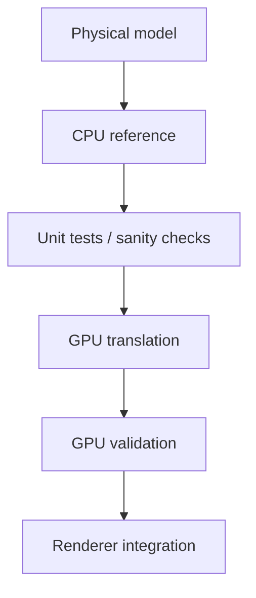

It is not the shortest path to a screenshot.

It is the shortest path to knowing why the screenshot is wrong.

---

## The Custom Sky Shader

Eventually all of the precomputation has to become pixels.

Godot's `shader_type sky` is the final atmospheric composition stage. The shader samples the precomputed atmosphere data and combines it with scene-independent procedural layers.

The basic pipeline is approximately:

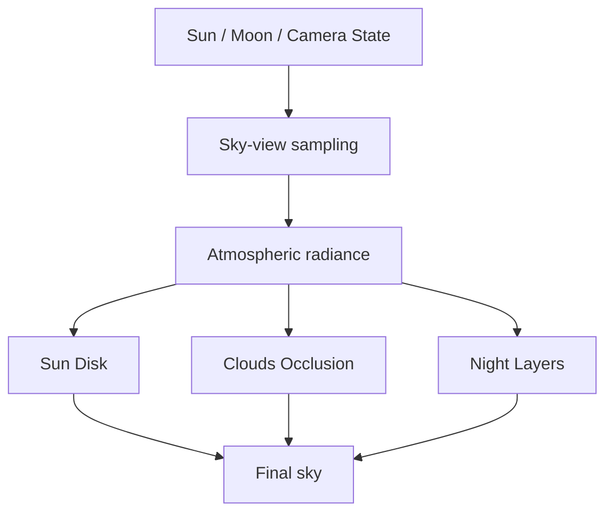

The sky shader is deliberately not a monolithic implementation of every possible feature.

Instead, procedural layers are isolated into shader includes:

- stars,
- moon,
- Milky Way,
- nebulae,
- aurora,
- clouds,
- and shared helper functions.

The night-sky implementation is a good example of this separation. Five independent layers share common fade and cloud-occlusion logic while remaining individually controllable, and none of the layers trigger atmospheric LUT regeneration because they are frame-dynamic rather than part of the precomputed scattering state.

This allows expensive atmospheric state and cheap visual state to evolve on different schedules.

---

## Celestial Rendering Is Part of the Same System

The atmosphere is driven by a celestial state rather than an arbitrary fixed light direction.

That state feeds several consumers:

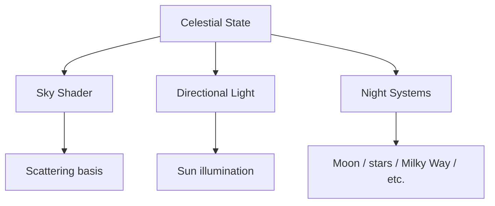

The important part is coherence.

If the visible sun moves in one direction while the `DirectionalLight3D` still lights the world from yesterday's direction, the renderer is technically functional and visually wrong.

The cloud refactor exposed exactly this class of bug: user-provided sun lights must be synchronized from the live celestial direction every frame so that scene shadows remain aligned with the visible sun.

The atmosphere therefore treats celestial state as shared rendering state, not just something used to place a sun disk in the sky.

---

## Clouds: From Occlusion to a Volume

The first cloud interface was intentionally simple.

The atmosphere only needed a way to ask:

```text
"How much of this direction is blocked by clouds?"
```

That abstraction was important because the atmosphere addon should not depend on the game's concrete cloud or weather implementation.

The interface evolved from a global coverage value toward direction-resolved sampling:

```gdscript
sample(direction: Vector3) -> float
```

The sky shader can then use a single cloud visibility value to affect several independent systems without any of those systems knowing what generated the cloud data.

For example:

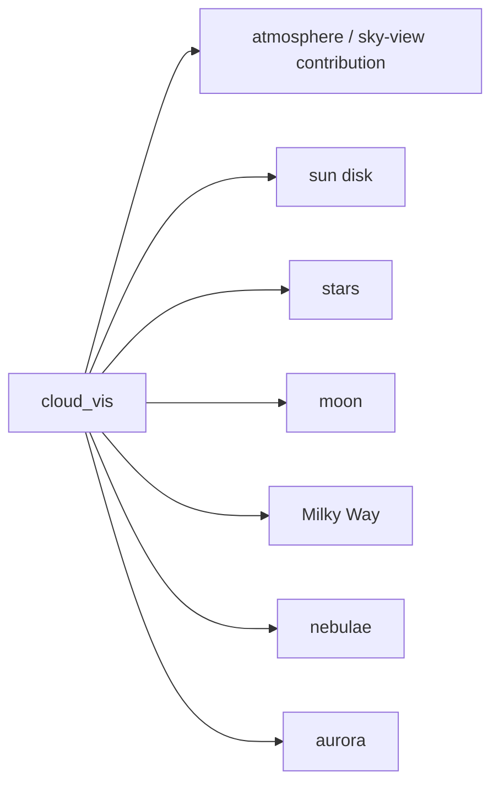

This is a small design decision with a large consequence: **clouds become a rendering input rather than a dependency shared by every feature.** The cloud implementation can change without rewriting the night-sky system.

### The Cloud Revamp

The later cloud refactor goes substantially further.

The legacy representation treated clouds essentially as a projected 2D pattern. The revamp treats a cloud as a **3D density field**:

$$
\rho(x)
=
\mathrm{fBm}(\mathrm{warp}(x))
\cdot P(h)
\cdot C(x)
$$

The density combines:

- domain-warped fractal noise,
- a vertical height profile,
- coverage,
- and a shell-space coordinate system.

Lighting through the volume then follows Beer-Lambert transmittance:

$$
T = e^{-\sigma D}
$$

and the cloud can sample toward the sun to obtain self-shadowing and the characteristic bright rims and darker interiors of lit volumetric clouds.

The performance problem becomes obvious when shadows are computed naively per screen pixel:

```text
screen pixels
 × view-ray steps
 × shadow-ray samples
 × noise evaluations
```

The refactor instead observes that a ground shadow mainly needs the **vertical optical depth through the cloud column**. That makes the shadow representation fundamentally 2D.

The resulting 256 × 256 R16F camera-relative shadow map reduces the problem from billions of per-frame noise evaluations to roughly a million density evaluations for the complete map, while making shadow cost independent of output resolution.

That is the kind of approximation this series is interested in: not "physically perfect at any cost," but **choose an approximation that preserves the perceptually important quantity**.

---

## Aerial Perspective: The Atmosphere Leaves the Sky

A sky can look correct while the world still looks completely detached from it.

Aerial perspective closes that gap.

Instead of computing atmospheric scattering only for sky pixels, the renderer can take the scene's depth buffer, reconstruct the world-space position of the visible surface, and evaluate atmospheric extinction along the camera-to-surface segment.

The resulting pipeline is:

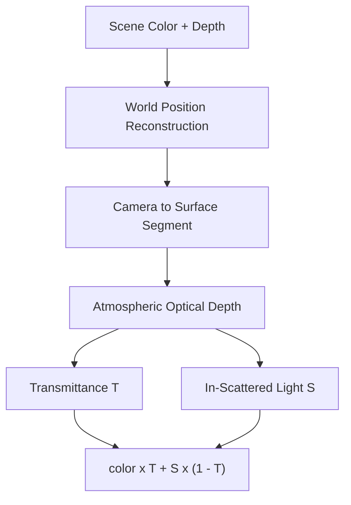

The implementation uses a `CompositorEffect`, reads resolved color/depth buffers, reconstructs world positions using the inverse projection and camera transform, computes segment optical depth, samples sky-view information for in-scattering, and composites directly into the resolved color buffer.

This stage is where the renderer starts behaving like a complete atmospheric system rather than simply a skybox replacement.

---

## Lighting Integration: The Sky Has to Illuminate the World

The renderer eventually needs to communicate atmospheric lighting to the rest of the scene.

The target is not a second independent lighting model.

The target is to derive a useful approximation from the same atmospheric state that produced the sky:

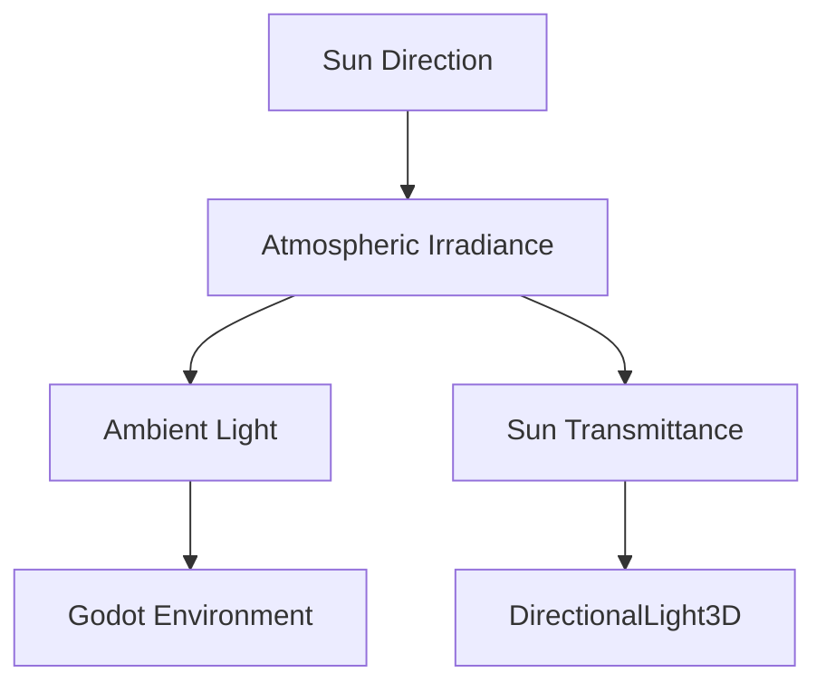

The first implementation evaluated a hemisphere integral on the CPU. It was mathematically defensible and computationally disastrous in GDScript.

The replacement uses a closed-form, column-integrated approximation based on atmospheric scale heights, phase averages, and solar transmittance. The resulting ambient evaluation drops from roughly 120 ms to below 0.01 ms in the documented implementation.

This is another recurring theme:

> **A physically motivated renderer still needs approximations chosen for the execution model of the engine.**

A correct equation implemented in the wrong place can be less useful than a well-chosen approximation that respects the frame budget.

---

## Runtime Weather Without Coupling the Addon to the Game

A reusable atmosphere system cannot assume it owns the game's weather system.

The addon should not import:

```text
WorldData
WeatherSystem
SeasonSystem
GameCloudSystem
```

Instead, the game provides information through narrow interfaces.

The weather provider exposes a small set of atmospheric inputs, while the atmosphere system remains responsible for deciding how those values affect the renderer.

This gives a clean boundary:

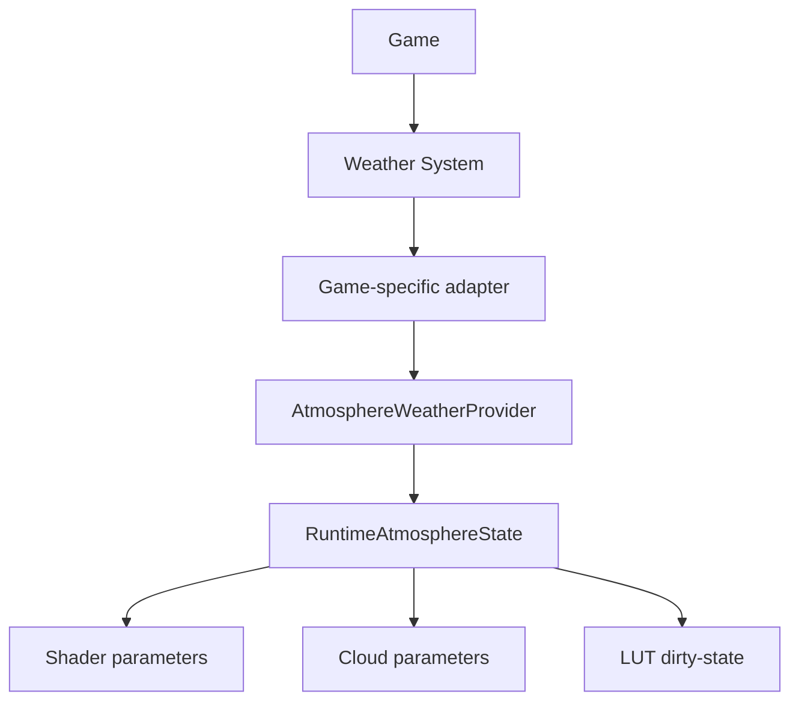

The important distinction is between **configuration** and **runtime state**.

Shared `.tres` profile Resources represent authoring configuration.

Runtime weather overrides live in separate state.

The runtime system never needs to mutate the artist's base profile just because humidity changed for thirty seconds.

This pattern also makes dirty tracking possible: parameters that affect static or precomputed data can request LUT regeneration, while frame-dynamic parameters can remain cheap uniform updates.

---

## Profiles, Presets, and the Public API

The rendering code is only one half of the system.

The other half is the API that exposes it to a Godot project.

The core configuration is composed from Resources with distinct responsibilities:

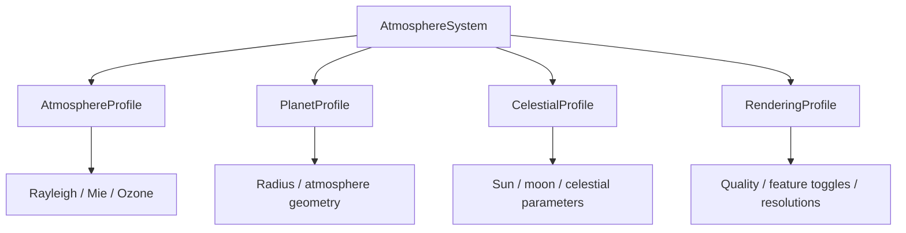

A preset can then bundle these resources and apply them together.

This is intentionally more granular than a single settings object.

It allows the system to validate individual domains, swap configurations, expose meaningful Inspector groups, and apply quality policies centrally.

The implementation also uses small provider interfaces for systems that must remain decoupled, such as clouds and weather. The overall data flow is designed so that an Inspector change, a preset assignment, or a runtime override eventually converges on the same shader-parameter and LUT-generation pathways rather than creating separate "editor" and "runtime" implementations.

---

## Quality Tiers Are Scheduling Policies

A quality setting is not just "more samples."

For this renderer it controls things such as LUT resolution and therefore changes where computation happens and how often it happens.

That gives a useful distinction:

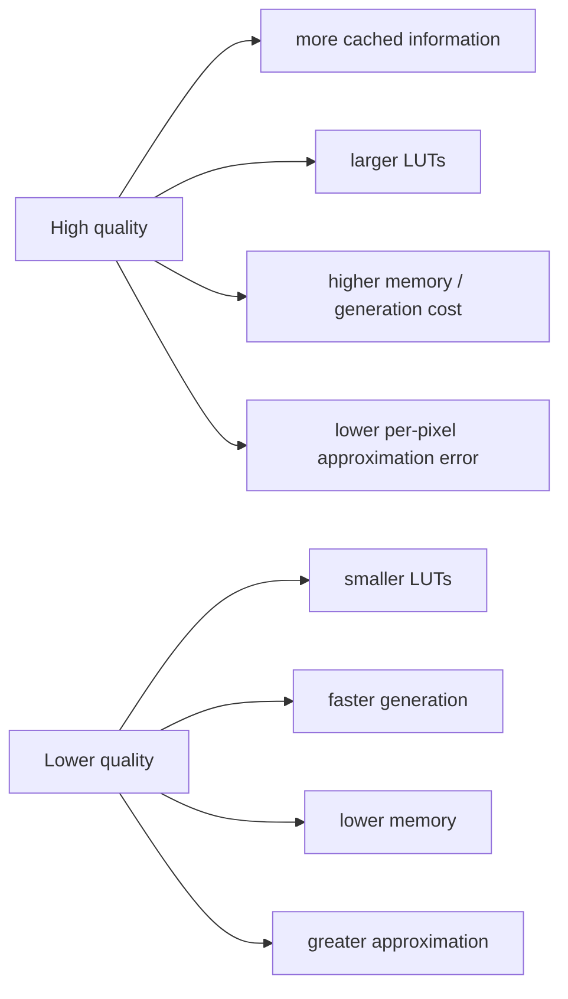

The quality system therefore sits above the individual LUT implementations rather than being hard-coded inside each shader.

This is important for maintainability. The transmittance shader should know how to generate transmittance. It should not need to know what "Medium" means for the entire addon.

---

## Editor Preview Is a Rendering Mode, Not a Separate Renderer

An artist-facing atmosphere system should not require launching the game every time a parameter changes.

The editor preview turns the addon into a live `@tool` system:

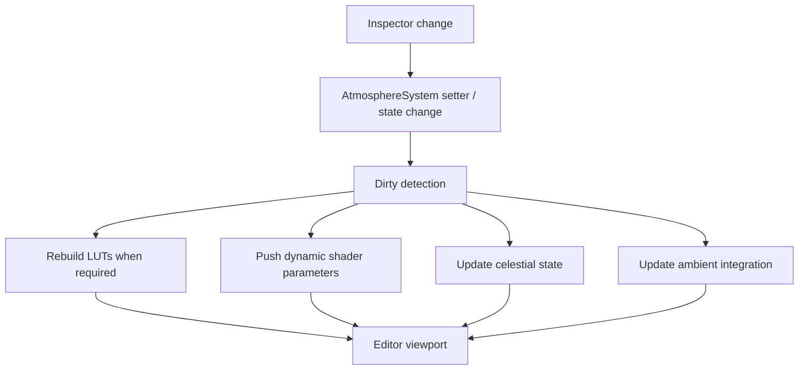

But editor execution introduces a different lifecycle.

The system must distinguish:

- scene deserialization,
- node readiness,
- user interaction,
- preview initialization,
- preview teardown,
- and normal runtime exit.

The implementation therefore snapshots the environment it mutates and restores it when preview ends. This prevents preview changes to `Environment`, camera, compositor state, and related resources from accidentally becoming saved scene state.

The preview path uses the same main-device compute infrastructure as the game renderer rather than creating a second rendering backend.

That is a recurring architectural goal throughout the project:

> **Do not build two systems when one system can operate in two modes.**

---

## The Custom Inspector Is the Last 10% That Makes the System Usable

Once there are dozens of parameters, a technically elegant API can still be painful to use.

The custom inspector exists to expose the architecture rather than hide it.

It provides:

- grouped configuration sections,
- quick presets,
- quality-tier selection,
- validation warnings,
- provider creation,
- and a clearer entry point into advanced settings.

The implementation lives in an `EditorInspectorPlugin`, while testable section definitions and data logic remain outside the editor-only layer. This keeps the editor integration useful without making the core data model impossible to test headlessly.

The distinction is important:

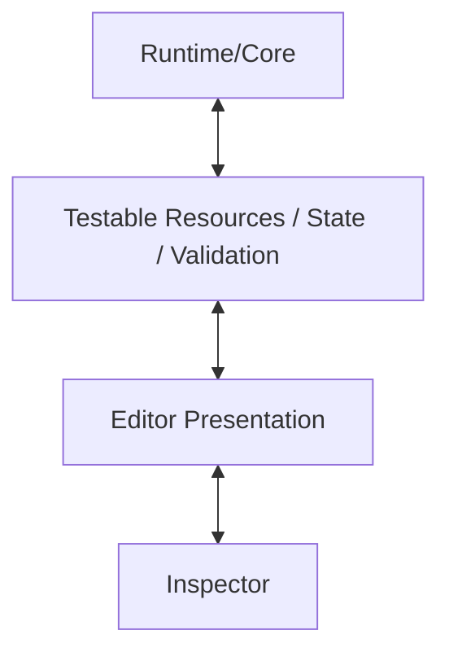

The Inspector is therefore a presentation layer over the same runtime API, not a second source of truth.

---

## Planetary Scale Changes the Assumptions

One of the most useful things about the series is that the renderer did not stop at "looks good from sea level."

The initial sky-view parameterization covered the upper hemisphere.

That is sufficient when the observer is standing on a planet.

It is not sufficient when the observer is in orbit.

Planetary mode therefore changes the problem in two ways:

1. The sky-view LUT must cover the **full sphere**, including below-horizon directions when the observer is outside the atmosphere.
2. Ray integration must account for whether the camera begins inside, intersects, or starts outside the atmospheric shell.

The full-sphere mapping becomes:

$$
v = \frac{\mathrm{altitude} + \pi/2}{\pi}
$$

so that:

```text
v = 0.0  → nadir
v = 0.5  → horizon
v = 1.0  → zenith
```

The system also centralizes `observer_r` so that the camera's altitude becomes shared state consumed by LUT generation, sky rendering, and related systems rather than being recomputed independently in several places.

This stage demonstrates an important principle:

> **Planetary rendering is often less about adding new physics than removing hidden assumptions from existing physics.**

---

## Coordinate Systems Are a First-Class Rendering Problem

Planetary-scale rendering exposes precision problems that do not appear in a small test scene.

If the planet radius is approximately 6.37 million metres, then directly feeding absolute world positions into 32-bit floating-point shader calculations gives the GPU a poor numerical representation of the small differences that actually matter for cloud noise, shadows, and local ray marching.

The cloud refactor therefore introduces coordinate virtualization:

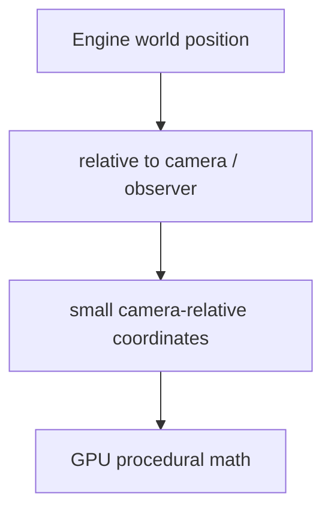

At the same time, the atmosphere keeps the observer's **radius from the planetary centre** as an explicit scalar because that is what the spherical scattering model actually needs.

This gives two different notions of position:

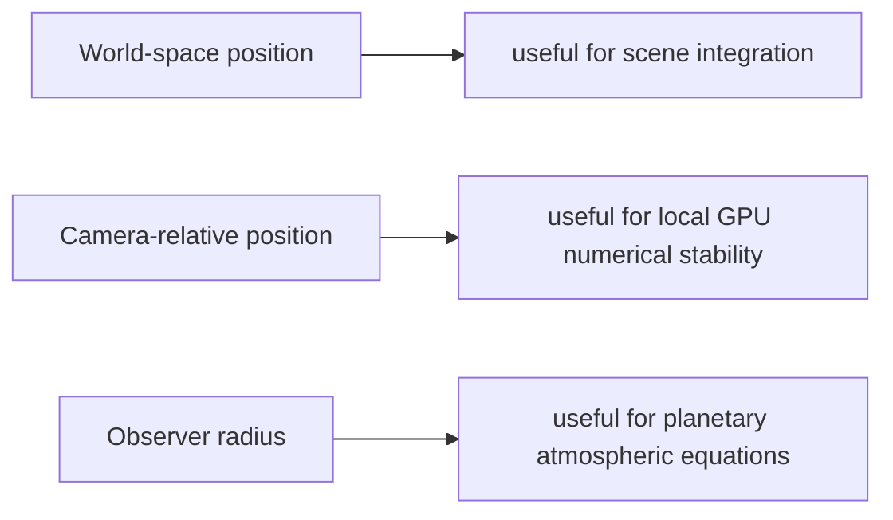

Conflating these three concepts was one of the sources of the most difficult cloud bugs in the refactor. Keeping them separate is part of the renderer's correctness model now.

---

## Performance Is Part of the Architecture

The renderer's performance work came after the feature work, but the lessons change how the whole system should be understood.

There are several fundamentally different classes of work:

### Static or Infrequent

Examples:

- LUT generation after structural parameter changes.
- Resource creation.
- Shader/pipeline setup.
- Preset application.

These can be expensive because they should not happen every frame.

### Frame Dynamic

Examples:

- sun direction,
- celestial animation,
- cloud coverage,
- weather values that only affect uniforms,
- night-sky animation.

These need to avoid allocations and unnecessary GPU work.

### Per Pixel

Examples:

- sky-view LUT sampling,
- cloud visibility,
- procedural night layers,
- final atmospheric compositing.

These need to be extremely conscious of instruction count and texture bandwidth.

The performance pass found several examples of work leaking into the wrong category:

```text
Dictionary creation every frame
GPU uniform-set creation inside a render callback
Redundant shader parameter uploads
Cloud values baked into textures when they should remain dynamic
LUT dirty-state checks allocating temporary dictionaries
```

The fixes were deliberately boring:

```text
reuse
cache
change-detect
persist
update in place
```

That is the point.

The renderer already had the right high-level decomposition. Performance work was largely about respecting the intended lifetime of each piece of data. The documented performance pass reports zero per-frame Dictionary allocations in the hot path for unchanged weather values and persistent GPU resources for aerial perspective rather than create/destroy operations in the render callback.

---

## Validation: The Renderer Is Not Finished When It Looks Good

A rendering system can produce beautiful screenshots while being architecturally broken.

The final validation pass exists to catch the problems that visual testing misses:

- stale parameter caches,
- leaked or dead GPU resource tracking,
- incomplete parameter sets,
- incorrect lifecycle assumptions,
- broken presets,
- missing scene dependencies,
- and engine-level constraints that only appear at planetary distances.

The current validation work includes unit tests for profiles, presets, LUT lifecycles, dirty state, aerial parameter completeness, and renderer safety, plus scene-level validation and regression runs across the previous phases.

The documented Phase 24 suite contains 49 validation tests, while the full regression pass re-runs the earlier phase tests and separately verifies GPU-dependent work when a real `RenderingDevice` is available.

The important distinction is between:

```text
"Does this module work?"
```

and:

```text
"Can I initialize it twice, rebuild it, feed it different profiles,
run it in the editor, move the camera into orbit, clean it up,
and still trust the result?"
```

The second question is what the validation phase is answering.

---

## The Series Roadmap

The implementation drafts naturally fall into a few broad sections.

This is the order in which the technical story makes the most sense, even when individual posts are published around the actual development timeline.

### 1. Physical and Rendering Foundations

The early material establishes the physical model and the renderer's vocabulary:

- atmospheric density models,
- Rayleigh scattering,
- Mie scattering and phase functions,
- ozone absorption,
- optical depth,
- wavelength-dependent coefficients,
- spherical ray geometry,
- celestial state,
- runtime state,
- and the separation between physical parameters and rendering controls.

These posts explain **what the renderer is trying to compute before discussing how Godot's GPU APIs are used to compute it**.

### 2. GPU Compute Infrastructure

The next layer is the reusable RenderingDevice foundation.

This covers:

- main versus local `RenderingDevice`,
- SPIR-V shader loading,
- compute pipelines,
- textures and buffers,
- uniform sets,
- resource ownership,
- dispatch sizing,
- synchronization,
- cleanup,
- and test infrastructure.

This is the plumbing that makes the LUT work possible rather than part of the atmosphere model itself.

### 3. Precomputed Atmospheric Lighting

The renderer then becomes a real GPU system through the LUT sequence:

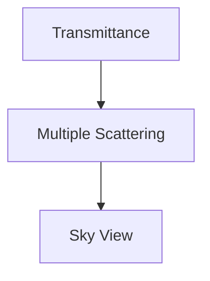

The transmittance stage establishes spherical optical-depth integration.

Multiple scattering restores the higher-order light contribution.

Sky-view caching moves repeated sky integration out of the final pixel shader.

Each post goes into the actual parameterization, integration strategy, GPU layout, resource lifecycle, and debugging failures rather than treating LUT generation as a black box. The transmittance implementation, for example, explicitly documents its UV mapping, CPU reference, GPU translation, edge cases, and lifecycle manager.

### 4. The Sky Renderer

Once the LUTs exist, the custom `shader_type sky` stage connects them to the screen.

This section covers:

- sky shader integration,
- transmittance sampling,
- sun disk rendering,
- sky-view sampling,
- Godot sky-shader restrictions,
- shader parameter injection,
- first-frame fallbacks,
- and the engine-specific mistakes that can leave an otherwise correct atmosphere completely black.

This is the point where the renderer stops being a collection of compute passes and becomes visibly a sky.

### 5. The Night Sky

The atmospheric background then becomes a composited environment rather than only scattering.

The night-sky layer is split into:

```text
Stars
Moon
Milky Way
Nebulae
Aurora
```

Each is procedurally generated and independently controlled, but they share common fading and cloud-occlusion infrastructure.

The intent is to keep these features **frame dynamic** and independent from the expensive LUT pipeline.

### 6. Runtime APIs and Integration

Once the renderer works visually, the system needs to become a reusable Godot component.

This part covers:

- Resource-based configuration,
- presets,
- quality tiers,
- runtime state,
- weather providers,
- cloud providers,
- dirty-state propagation,
- shader parameter aggregation,
- and the boundaries between the addon and the host game.

The key question becomes:

> How do I expose atmospheric state without forcing the renderer to know anything about the game that owns it?

### 7. Clouds and Scene Interaction

The cloud work starts as an interface and procedural coverage layer, then develops into a substantially more advanced volumetric implementation.

This section covers:

- direction-resolved cloud visibility,
- procedural fBm,
- domain warping,
- cloud shell coordinates,
- Beer-Lambert extinction,
- volumetric ray marching,
- self-shadowing,
- camera-relative coordinates,
- and the 2D optical-depth shadow-map approximation.

The cloud refactor is especially useful as a case study in scaling a feature from "it visually works" into "it works at planetary coordinates without destroying the frame."

### 8. Aerial Perspective

This is where the atmosphere interacts with ordinary scene geometry.

The implementation covers:

- Godot `CompositorEffect`,
- resolved color/depth access,
- reversed-Z depth,
- view-space reconstruction,
- world-space reconstruction,
- atmospheric segment integration,
- sky-view based in-scattering,
- and final color compositing.

This stage explains the interface between Godot's normal scene renderer and a custom atmospheric compute pass.

### 9. Ambient and Lighting Integration

The renderer then feeds useful atmospheric information back into the scene:

- diffuse ambient irradiance,
- environment lighting,
- sun transmittance,
- light colour,
- day/night response,
- and coherence between celestial state and scene lighting.

The interesting part here is not just the lighting result, but the trade-off between numerical integration and a closed-form approximation suitable for runtime evaluation.

### 10. Editor Tooling

The final implementation layer turns the renderer into an actual tool for technical artists and environment artists.

This includes:

- `@tool` execution,
- live viewport preview,
- environment snapshots,
- preview lifecycle management,
- custom Inspector sections,
- quick presets,
- validation warnings,
- and editor-safe resource handling.

The same rendering backend is reused; the main difference is the lifecycle around it.

### 11. Performance and Production Hardening

The production-oriented posts cover the work that tends to happen after a renderer already looks good:

- eliminating hot-path allocations,
- reusing GPU resources,
- caching uniform sets,
- reducing shader work,
- separating dynamic and rebuild-sensitive parameters,
- validating resource ownership,
- and making regeneration predictable.

This is where the architecture gets measured against an actual frame budget.

### 12. Planetary Mode and Validation

The final stage expands the renderer's assumptions from "surface sky" to "planet-scale renderer":

- full-sphere sky-view parameterization,
- outside-atmosphere ray handling,
- observer altitude tracking,
- shared observer radius,
- camera-relative cloud coordinates,
- known Godot Forward+ limits,
- scene validation,
- regression testing,
- and final stabilization.

The result is one `AtmosphereSystem` that can operate from a surface camera to orbital altitude, within the documented limitations of the engine and current cloud implementation.

---

## How to Read the Individual Posts

These posts are deliberately not written as beginner tutorials.

They assume that the reader is comfortable with concepts such as:

- GPU pipelines,
- shader execution,
- vector and matrix mathematics,
- texture formats,
- ray marching,
- numerical integration,
- rendering passes,
- Godot Resources and nodes,
- and the basic distinction between CPU and GPU work.

The intended reading style is closer to an engineering notebook than to a textbook.

Some posts explain a completed design.

Some are debugging stories.

Some focus on a single subsystem.

Some exist mainly because a particular failure taught something that would otherwise be very easy to forget.

For example:

A texture format mismatch can make a correct compositor silently write nothing.

A single incorrect `std140` assumption can invalidate an entire uniform block.

A ground intersection at exactly `t = 0` can make an apparently correct optical-depth calculation traverse the whole atmosphere.

A camera near plane that is perfectly reasonable at game scale can become incompatible with planetary-scale Forward+ clustering.

A mathematically correct lighting integral can still cost more than the entire frame budget when executed in GDScript.

These are not side stories.

They are part of the implementation.

---

## The Engineering Philosophy Behind the Series

There are a few principles that repeatedly appear across the project.

### Physical Motivation, Not Physical Purism

The renderer uses physically motivated quantities and relationships, but it does not pretend that every step is an exact reference implementation.

The right question is often:

> "What physical quantity matters here, and what is the cheapest approximation that preserves the behaviour users will notice?"

Multiple scattering is approximated.

Ambient irradiance is approximated analytically.

Cloud shadows are reduced to a 2D optical-depth field.

Sky radiance is precomputed into LUTs instead of being integrated independently for every pixel.

The goal is perceptual and physical plausibility within a real-time budget.

### Separate State by Lifetime

Not all parameters deserve the same update frequency.

A useful mental model is:

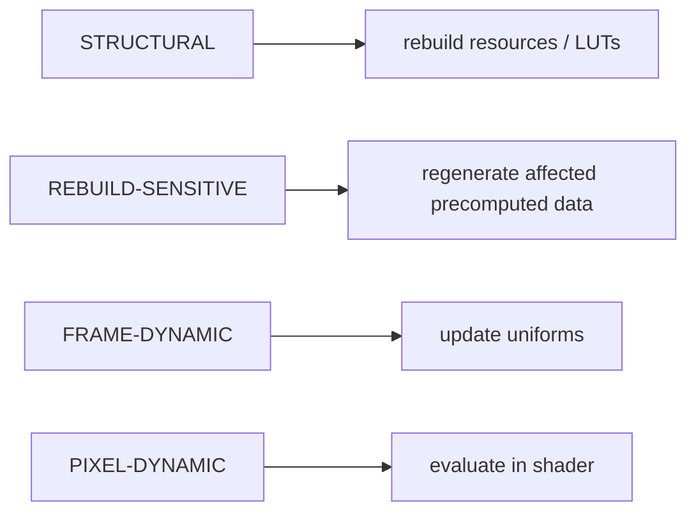

Many performance bugs in the project came from treating one class like another.

### Let Interfaces Absorb Game-Specific Knowledge

The atmosphere should know how to interpret humidity.

It should not know what a game's weather system is called.

It should know how to sample cloud visibility.

It should not know how those clouds are generated.

It should know how to update a `DirectionalLight3D`.

It should not assume that it owns the project's sun node.

That separation is what makes the addon reusable.

### Make Failures Loud at the Boundary

Rendering code has too many ways to fail silently.

The implementation therefore deliberately validates:

- shader loading,
- SPIR-V compilation,
- GPU resource validity,
- texture formats,
- parameter completeness,
- profile validity,
- device availability,
- and cleanup state.

A renderer that fails safely and tells you why is considerably more useful than one that simply produces a black frame.

### Test the Math Before the Beauty

Screenshots are useful.

They are not enough.

The project treats numerical sanity checks, lifecycle tests, resource tests, and scene-level validation as part of rendering correctness.

The goal is not simply to produce an image that looks right today.

The goal is to have enough evidence that a refactor six months from now did not quietly change the physics, leak a GPU resource, or move a parameter into the wrong coordinate system.

---

## Where the Architecture Landed

At the end of the implementation, the renderer can be understood as several layers rather than one enormous system:

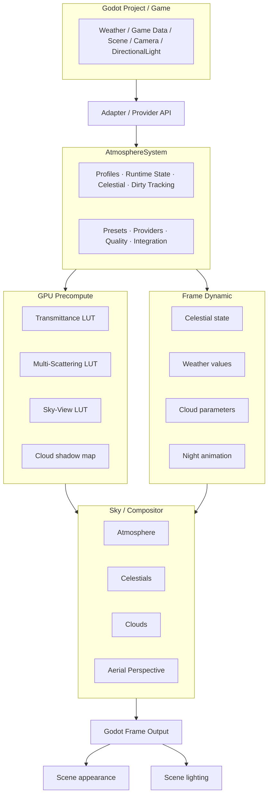

This decomposition is the main thing I want the series to preserve.

The equations will change.

The shaders will change.

The quality settings will change.

The cloud model will probably change again.

But the architectural questions stay the same:

```text
Who owns this resource?
Who computes this value?
When does it change?
Who consumes it?
Can it be tested independently?
Can it fail without breaking the renderer?
```

Those questions are as important to an engine-facing technical art system as the scattering equations themselves.

---

## What This Series Is Really About

On the surface, this is a series about building an atmosphere renderer.

Underneath, it is really a series about **turning rendering mathematics into an engine subsystem**.

That means dealing with all the layers between a paper equation and a shipped feature:

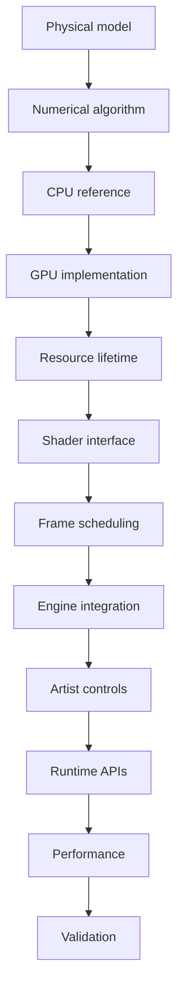

That is why the later posts spend just as much time on `RenderingDevice`, `std140`, `Texture2DRD`, `@tool`, providers, dirty flags, resource ownership, and validation as they do on Rayleigh and Mie scattering.

The rendering equation is only the beginning.

The interesting engineering starts when that equation has to live inside an engine.

---

## Final State

The completed system provides:

- physically motivated Rayleigh, Mie, and ozone atmospheric behaviour,
- precomputed transmittance, multiple-scattering, and sky-view data,
- a custom Godot sky shader,
- sun and moon rendering,
- procedural stars, Milky Way, nebulae, and aurora,
- cloud interfaces and a volumetric cloud path,
- cloud self-shadowing through a camera-relative optical-depth map,
- aerial perspective through a compositor compute pass,
- atmospheric ambient-light integration,
- runtime weather and cloud providers,
- profile and preset-based configuration,
- live editor preview,
- a custom Inspector,
- quality tiers,
- performance-oriented resource and parameter lifetimes,
- planetary/surface-to-orbit operation,
- and a validation suite covering both isolated modules and the integrated addon.

The validation phase concluded with the system operating as a single `AtmosphereSystem` rather than a set of disconnected demonstrations, with known engine-level limitations documented rather than hidden.

---

## The Posts Ahead

The individual posts will now unpack these pieces one at a time.

Some will start from the mathematics.

Some will start from an engine API.

Some will start with a broken frame and work backwards.

That is intentional.

A renderer is usually understood from two directions:

```text
Theory → Implementation
```

and:

```text
Implementation Failure → Theory
```

The first tells you how the system is supposed to work.

The second tells you what the theory forgot to mention.

Both are useful.

---

## References

- [Sebastian Hillaire — "A Scalable and Production Ready Sky and Atmosphere Rendering Technique"](https://sebh.github.io/publications/egsr2020.pdf)
- [Bruneton and Neyret — "Precomputed Atmospheric Scattering"](https://inria.hal.science/inria-00288758/document)
- [Godot 4.5 — Using Compute Shaders](https://docs.godotengine.org/en/4.5/tutorials/shaders/compute_shaders.html)
- [Godot 4.5 — RenderingDevice](https://docs.godotengine.org/en/4.5/classes/class_renderingdevice.html)
- [Godot 4.5 — Texture2DRD](https://docs.godotengine.org/en/stable/classes/class_texture2drd.html)

---

*The rest of the series goes into the implementation.*
